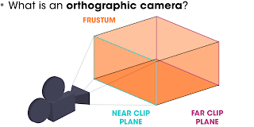
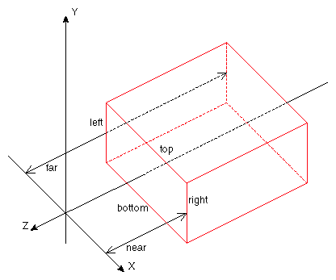
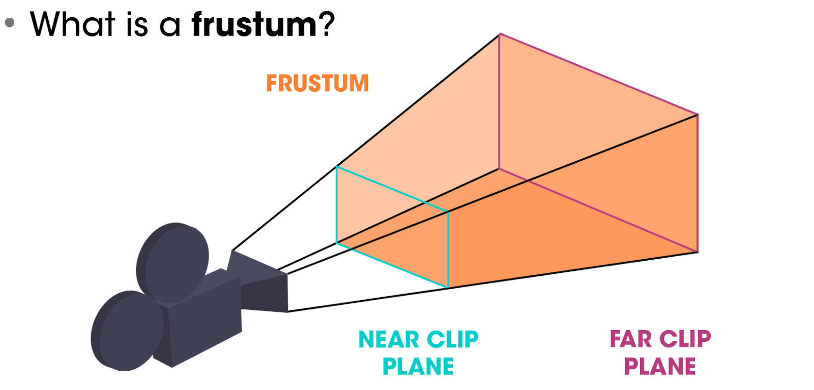
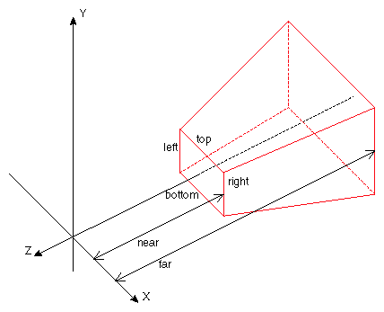
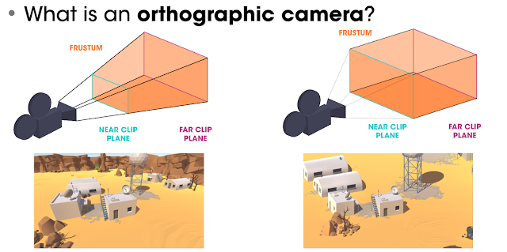
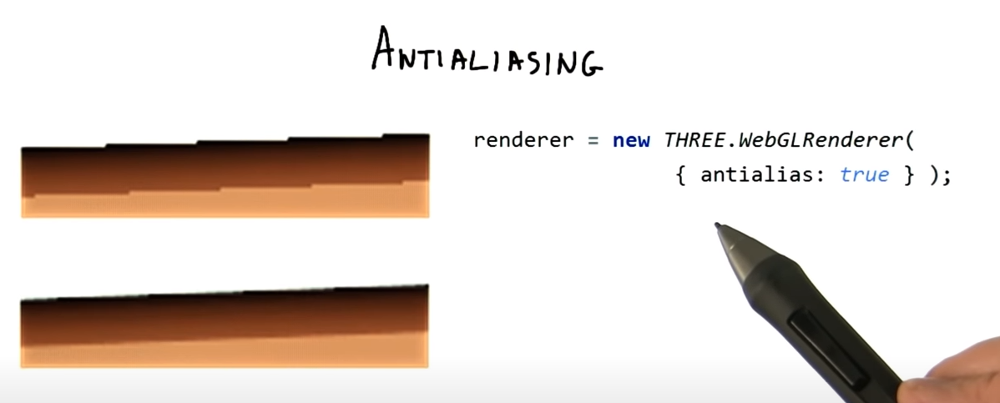

## OrthographicCamera
___
[Object3D → Camera → OrthographicCamera]

Camera that uses `orthographic projection`.  
직교 투영(直交 投影, orthographic projection)은 대상물의 주요 면을 사영하는 면에 평행한 상태로 놓고 사영선은 서로 나란하게, 사영면에 수직으로 닿는다. 어떤 점과 선, 면의 사영이기도 하다. 

> 정리 : 
원근감이 있게 표현하는 것은 Perspective(원근) 투영이라 하고 원근감이 없게 표현하는 것을 Orthographic(직교) 투영이라고 합니다.


In this projection mode, an object's size in the rendered image stays constant regardless of its distance from the camera.

이 투영 모드에서 렌더링 된 이미지의 개체 크기는 카메라와의 거리에 관계없이 일정하게 유지됩니다.

This can be useful for rendering 2D scenes and UI elements, amongst other things.


이는 무엇보다도 2D 장면 및 UI 요소를 렌더링하는 데 유용 할 수 있습니다.


```js
const camera = new THREE.OrthographicCamera( width / - 2, width / 2, height / 2, height / - 2, 1, 1000 );
scene.add( camera );
```

> Constructor
OrthographicCamera( left : Number, right : Number, top : Number, bottom : Number, near : Number, far : Number )

* left — Camera frustum left plane.
* right — Camera frustum right plane.
* top — Camera frustum top plane.
* bottom — Camera frustum bottom plane.
* near — Camera frustum near plane.
* far — Camera frustum far plane.

> frustum 은 절두체 이고 절두체는 다음과 같다.







따라서 perspective뷰에서는 좌측과 같이 거리가 먼 오브젝트는 작게 나타나지만 orthographic뷰에서는 우측처럼 거리가 멀다고 해서 오브젝트가 작게 표현되지 않습니다.

Orthographic 뷰에서는 거리요소를 고민할 필요가 없이 단순히 카메라의 크기를 크게하면 frustum의 크기가 커져 더 많은 물체가 보이게 되므로 줌아웃이 되고 작게하면 더 적은 물체가 보이게 되므로 줌인이 됩니다.

* CameraHelper를 이용하여 실시간으로 절두체 시점을 확인할수 있다.
[절두체 참고](https://threejs.org/docs/#api/en/helpers/CameraHelper)


> .updateProjectionMatrix () : null

Updates the camera projection matrix. Must be called after any change of parameters.

카메라 속성을 바꾼후에는 이메서드를 호출해주어야 한다.


## WebGLRenderer
___

The WebGL renderer displays your beautifully crafted scenes using `WebGL`.

> WebGL이란..

WebGL (Short for Web Graphics Library )은 플러그인을 사용하지 않고 호환되는 웹 브라우저 내에서 대화 형 2D 및 3D 그래픽을 렌더링 하기 위한 JavaScript API 입니다 . [2] WebGL은 다른 웹 표준 과 완전히 통합되어 웹 페이지 캔버스의 일부로 물리 및 이미지 처리 및 효과를 GPU 가속으로 사용할 수 있습니다. WebGL 요소는 다른 HTML 요소와 혼합되고 페이지 또는 페이지 배경의 다른 부분과 합성 될 수 있습니다. [3]

> Constructor

WebGLRenderer( parameters : Object )

```js
this.renderer = new THREE.WebGLRenderer({antialias: true});
```

antialias

0


## OrthographicCamera
___
[Object3D → Light → DirectionalLight]

A light that gets emitted in a specific direction. This light will behave as though it is infinitely far away and the rays produced from it are all parallel. The common use case for this is to simulate daylight; the sun is far enough away that its position can be considered to be infinite, and all light rays coming from it are parallel.

특정 방향으로 방출되는 빛. 이 빛은 마치 무한히 멀리 떨어져있는 것처럼 작동하며 그로부터 생성되는 광선은 모두 평행합니다. 이에 대한 일반적인 사용 사례는 일광을 시뮬레이션하는 것입니다. 태양은 그 위치가 무한한 것으로 간주 될 수있을만큼 충분히 멀리 떨어져 있으며 태양에서 나오는 모든 광선은 평행합니다.

[DirectionalLight 참고](https://dev-t-blog.tistory.com/23?category=683744/)


* DirectionalLightHelper를 이용하여 실시간으로 빛의 상태를 확인할수 있다..
[DirectionalLightHelper 참고](https://www.kenji-special.info/tubugl-lighting-kyoshitsu/)


## Geometry
___

> Geometry란?

Geometry is a user-friendly alternative to BufferGeometry. Geometries store attributes (vertex positions, faces, colors, etc.) using objects like Vector3 or Color that are easier to read and edit, but less efficient than typed arrays.

Prefer BufferGeometry for large or serious projects.

Geometry는 BufferGeometry에 대한 사용자 친화적 인 대안입니다. Geometries는 Vector3 또는 Color와 같은 개체를 사용하여 속성 (정점 위치,면, 색상 등)을 저장합니다. 이러한 개체는 읽기 및 편집이 더 쉽지만 형식화 된 배열보다 효율성이 떨어집니다.

크거나 심각한 프로젝트에는 BufferGeometry를 선호합니다.

Threejs 뿐만 아니라 대부분의 3D library에서 geomtry는 기본적으로 3D 공간에서의 점들(Vertices 라고 불립니다.)과 그러한 점들을 연결하는 Face들의 집합입니다.
저희들이 ThreeJS에서 제공되는 geometry를 사용할 때는 모든 vertices와 faces를 직접 정의할 필요없습니다. 큐브의 경우, 단지 width, height, depth만 정의해줄 필요가 있습니다. 그렇게하면 ThreeJS에서 받은 정보를 바탕으로 8 vertices와 그에 알맞은 face를 가진 geometry를 만들냅니다.
하지만 저희가 직접 vertices와 faces를 사용해서 geometry를 만들 수도 있습니다.


## `PlaneGeometry`

[Geometry → PlaneGeometry]
A class for generating plane geometries

```js
const geometry = new THREE.PlaneGeometry( 5, 20, 32 );
const material = new THREE.MeshBasicMaterial( {color: 0xffff00, side: THREE.DoubleSide} );
const plane = new THREE.Mesh( geometry, material );
scene.add( plane );
```

> Constructor

PlaneGeometry(width : Float, height : Float, widthSegments : Integer, heightSegments : Integer)

* width — Width along the X axis. Default is 1.
* height — Height along the Y axis. Default is 1.
* widthSegments — Optional. Default is 1.
* heightSegments — Optional. Default is 1.

> 기초 정리

기하학적 형태, 뼈대를 담당하는 부분을 Geometry 라 부른다. 구슬로 치자면 “반지름이 얼마짜리 구형 물체” 라는 정보가 여기에 해당한다.
특정한 질감, 색, 반사율 등을 갖는 물체의 표면을 Material이라 부른다. 구슬로 치면 “은색이고 매끈하며 반사율이 높은 쇠 표면” 혹은 “투명하며 빛을 대부분 투과시기는 유리 표면” 등의 정보가 여기에 해당한다.
그리고 이 Geometry에 Material이 입혀진 오브젝트를 three.js 에서는 Mesh라 부른다. Mesh 라는 용어의 정확한 학문적인 의미가 궁금해서 찾아도 보고 주변에 물어도 보았는데, 정확한 의미를 갖고 있다기보다는 어느정도 관용적으로 사용되는 용어인 듯 한다. 이하 글에서는 three.js 에서 사용되는 대로 Geometry 와 Material의 합을 Mesh라 부르겠다.

물체(Mesh) = 뼈대(Geometry) + 표면(Material)